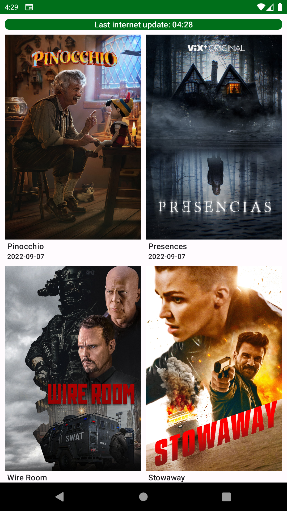
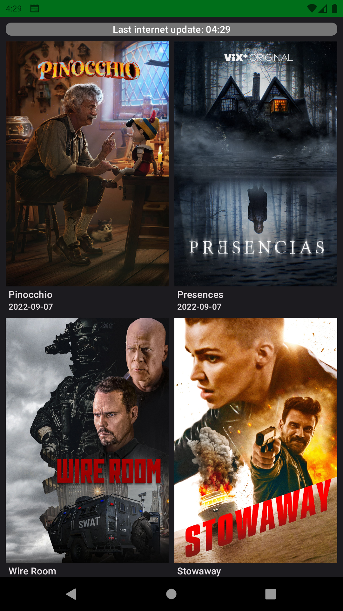

# Quick User Manual

  

### TLDR

AMDB is a movie data base based on [TMDB API](https://developers.themoviedb.org/3).

### What it does

It fetches the most popular movies on TMDB Data base and save it on the device for offline further
reference.

#### In details

* Application try to refresh data each time the main screen is displayed
* It saves the last list in a local data base
* User can refresh list with "push to refresh" gesture i.e swiping to the bottom the movie list
* There is a card on top of the screen that displays:
  * If the app is updating data
  * The time of last internet update
  * if the last internet update has failedand the reason why.

### Theming and languages

* The application is available in English and French (Oui Monsieur ! 🥖🍷)
* The application has two themes: light and dark

  
&nbsp; &nbsp; &nbsp; &nbsp;
  

