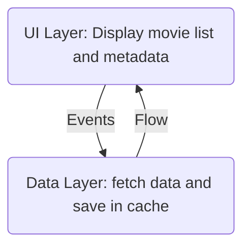

# Technical Presentation

## Disclaimer

I recommend you to try the app or at least to read
the [Quick User Manual](../manual/QuickUserManual.md) before reading this documentation!

## From user journey to implementation
The application is basically doing this:

* Fetch data from TMDB API each time main screen is displayed
* Save data in a cache if it's OK,get data from cache if KO
* Display it (and allow user to update manually by pull list down)

This is explained in details here:
[From user journey to implementation](./UserJourney.md).

## Theming
The app can use light and dark theme linked to device configuration.  
It's managed [here](../../app/src/main/java/eu/benayoun/androidmoviedatabase/ui/theme/Theme.kt) (
with very few modifications from code generated on creation by Android Studio)

## Languages supported

The app manage two languages with the classical `strings.xml` system

* [english](../../app/src/main/res/values/strings.xml)
* [french ](../../app/src/main/res/values-fr/strings.xml) (oh que oui)

## Project organisation

### Android Tools

This app tries to use in the best way these [Android tools](./AndroidTools.md)

### Global architecture

The app try to
respect [Android app architecture](https://developer.android.com/topic/architecture#recommended-app-arch)
with two layers: `ui` and `data`.

#### UI and data Layers

There are organized like this:

Don't see this diagram in Android studio? (see
this [tip](https://www.jetbrains.com/help/idea/markdown.html#enable-diagrams))

### Modules

This application is decomposed in 3 **Gradle** modules:

* [app](../../app): Regroups the `AMDBApplication` class and all the `ui` layer
* [data](../../data): Contains the `data` layer
* [utils](../../utils): Contains only a little Log helper both used in data and app layers

### Interfaces everywhere

Interfaces are central to this project. I use them whenever I can, especially in data layer. And I
comment them as much as I can to explain what they do.

I also use "Default" implementation where I must and more specific words where I can: `Retrofit`
, `Room` and so on...

When I need I also use "Fake" implementations to help me test the application (manually or with
automatic tests)

