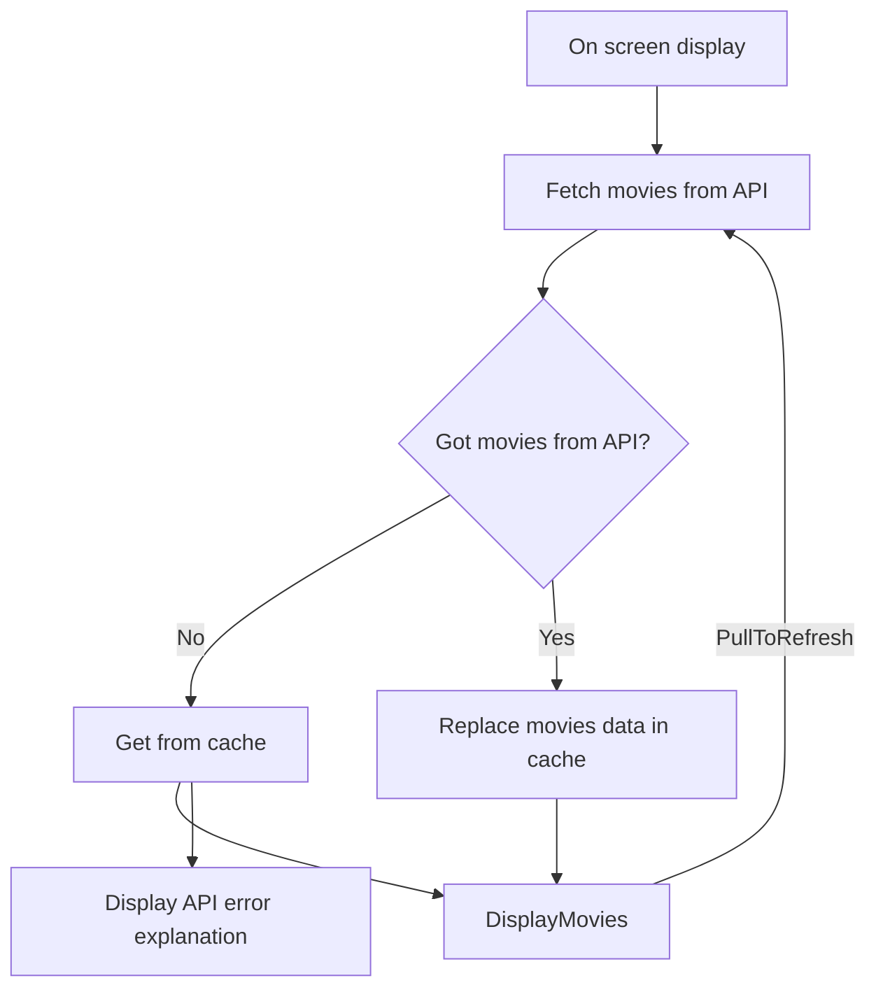
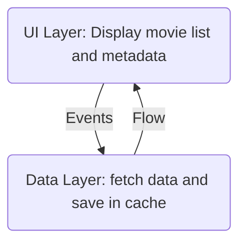

# Technical Presentation

## Disclaimer

I recommend you to try the app or at least to read
the [Quick User Manual](../manual/QuickUserManual.md) before reading this documentation!

## From user journey to implementation

The application is basically doing this:

* Fetch data from TMDB API each time main screen is displayed
* Save data in a cache if it's OK,get data from cache if KO
* Display it (and allow user to update manually by pull list down)

Don't see this diagram in Android studio? (see
this [tip](https://www.jetbrains.com/help/idea/markdown.html#enable-diagrams))

### Fetching Data

The application basically fetches data from [TMDB API](https://developers.themoviedb.org/3)

*
Interface: [TmdbDataSource](../../data/src/main/java/eu/benayoun/androidmoviedatabase/data/source/network/TmdbDataSource.kt)
* Default implementation
  with [Retrofit](https://square.github.io/retrofit/): [RetrofitTmdbDataSource](../../data/src/main/java/eu/benayoun/androidmoviedatabase/data/source/network/retrofit/RetrofitTmdbDataSource.kt)

### Saving Data

It saves this in a dataBase with metadata.

* Global
  TmdbCache: [TmdbCache](../../data/src/main/java/eu/benayoun/androidmoviedatabase/data/source/local/TmdbCache.kt)

#### Movie List

The list of movies from TMDB
* Model: [TmdbMovie](../../data/src/main/java/eu/benayoun/androidmoviedatabase/data/model/TmdbMovie.kt)
* Cache Interface: [TmdbMoviesCache](../../data/src/main/java/eu/benayoun/androidmoviedatabase/data/source/local/movies/TmdbMoviesCache.kt)
* Default implementation with [Room](https://developer.android.com/jetpack/androidx/releases/room): [RoomTmdbMoviesCache](../../data/src/main/java/eu/benayoun/androidmoviedatabase/data/source/local/movies/room/RoomTmdbMoviesCache.kt)

#### Metadata
Metadata are about:
* Last internet update
* the source status of the data (Internet or cache if offline for example) and eventual errors.
* The status of update (is it updating right now? 😛)

**Model**
  * [TmdbMetadata](../../data/src/main/java/eu/benayoun/androidmoviedatabase/data/model/meta/TmdbMetadata.kt) with last internet update time stamp
  * [TmdbSourceStatus](../../data/src/main/java/eu/benayoun/androidmoviedatabase/data/model/meta/TmdbSourceStatus.kt)
  * [TmdbUpdateStatus](../../data/src/main/java/eu/benayoun/androidmoviedatabase/data/model/meta/TmdbUpdateStatus.kt)

**Interface**    
[TmdbMetaDataCache](../../data/src/main/java/eu/benayoun/androidmoviedatabase/data/source/local/metadata/TmdbMetaDataCache.kt)

**Default implementation**  
It's done
with [Proto DataStore](https://developer.android.com/topic/libraries/architecture/datastore):  
[DataStoreTmdbMetaDataCache](../../data/src/main/java/eu/benayoun/androidmoviedatabase/data/source/local/metadata/datastore/DataStoreTmdbMetaDataCache.kt)

### Display data and interactions

#### Display
* Main Class: [HomeScreen](../../app/src/main/java/eu/benayoun/androidmoviedatabase/ui/compose/screens/home/HomeScreen.kt) 
* View model: [HomeViewModel](../../app/src/main/java/eu/benayoun/androidmoviedatabase/ui/compose/screens/home/model/HomeViewModel.kt)

#### Interactions
* Pull to refresh system can be found at the end of this [file](../../app/src/main/java/eu/benayoun/androidmoviedatabase/ui/compose/screens/home/composables/MovieGridComposable.kt).

#### Theming
The app can use light and dark theme linked to device configuration.  
It's managed [here](../../app/src/main/java/eu/benayoun/androidmoviedatabase/ui/theme/Theme.kt) (
with very few modifications from code generated on creation by Android Studio)

#### Languages supported

The app manage two languages with the classical `strings.xml` system

* [english version](../../app/src/main/res/values/strings.xml)
* [french version](../../app/src/main/res/values-fr/strings.xml) (oh que oui)

## Project organisation

### Global architecture

The app try to
respect [Android app architecture](https://developer.android.com/topic/architecture#recommended-app-arch)
with two layers: `ui` and `data`.

#### Ui adn data Layers

There are organized like this:

Don't see this diagram in Android studio? (see
this [tip](https://www.jetbrains.com/help/idea/markdown.html#enable-diagrams))

### Interfaces everywhere

Interfaces are central to this project. I use them whenever I can. And I comment them as much as I
can to explain what they do.

I also use "Default" implementation where I must and more specific words where I can: `Retrofit`
, `Room` and so on...

When I need i also use "Fake" implementations to help me test the application (manually or with
automatic tests)

#### Modules

This application is decomposed in 3 **Gradle** modules:
* [app](../../app): Regroups the `AMDBApplication` class and all the `ui` layer
* [data](../../data): Contains the `data` layer
* [utils](../../utils): Contains only a little Log helper both used in data and app layers

#### UI

#### Data

