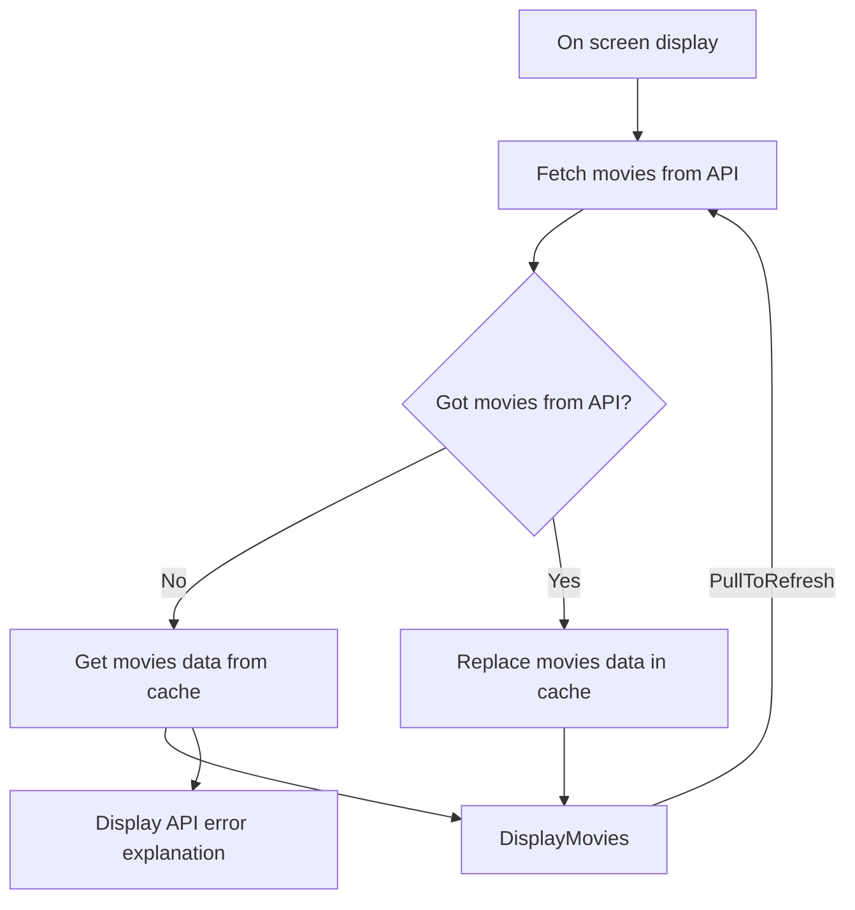

# From user journey to implementation

## TLDR

The application is basically doing this:

* Fetch data from TMDB API each time main screen is displayed
* Save data in a cache if it's OK,get data from cache if KO
* Display it (and allow user to update manually by pull list down)

Don't see this diagram in Android studio? (see
this [tip](https://www.jetbrains.com/help/idea/markdown.html#enable-diagrams))

## Fetching Data

The application basically fetches data from [TMDB API](https://developers.themoviedb.org/3)

*
Interface: [TmdbDataSource](../../data/src/main/java/eu/benayoun/androidmoviedatabase/data/source/network/TmdbDataSource.kt)
* Default implementation
  with [Retrofit](https://square.github.io/retrofit/): [RetrofitTmdbDataSource](../../data/src/main/java/eu/benayoun/androidmoviedatabase/data/source/network/retrofit/RetrofitTmdbDataSource.kt)
* Fake implementation (that fill data with a static
  list) : [FakeTmdbDataSource](../../data/src/main/java/eu/benayoun/androidmoviedatabase/data/source/network/FakeTmdbDataSource.kt)

## Saving Data

It saves this in a dataBase with metadata.

The entry class
is [TmdbCache](../../data/src/main/java/eu/benayoun/androidmoviedatabase/data/source/local/TmdbCache.kt)
that regroups classes that manages movie list and Metadata.

### Movie List

The list of movies from TMDB

*
Model: [TmdbMovie](../../data/src/main/java/eu/benayoun/androidmoviedatabase/data/model/TmdbMovie.kt)
* Cache
  Interface: [TmdbMoviesCache](../../data/src/main/java/eu/benayoun/androidmoviedatabase/data/source/local/movies/TmdbMoviesCache.kt)
* Default implementation
  with [Room](https://developer.android.com/jetpack/androidx/releases/room): [RoomTmdbMoviesCache](../../data/src/main/java/eu/benayoun/androidmoviedatabase/data/source/local/movies/room/RoomTmdbMoviesCache.kt)

### Metadata

Metadata are about:

* Last internet update
* the source status of the data (Internet or cache if offline for example) and eventual errors.
* The status of update (is it updating right now? 😛)

#### Model

* [TmdbMetadata](../../data/src/main/java/eu/benayoun/androidmoviedatabase/data/model/meta/TmdbMetadata.kt)
  with last internet update time stamp
* [TmdbSourceStatus](../../data/src/main/java/eu/benayoun/androidmoviedatabase/data/model/meta/TmdbSourceStatus.kt)
  that details the source of the data: Internet or Cache
* [TmdbUpdateStatus](../../data/src/main/java/eu/benayoun/androidmoviedatabase/data/model/meta/TmdbUpdateStatus.kt)
  the status: is it updating?

#### Interface

[TmdbMetaDataCache](../../data/src/main/java/eu/benayoun/androidmoviedatabase/data/source/local/metadata/TmdbMetaDataCache.kt)

#### Default implementation

It's done
with [Proto DataStore](https://developer.android.com/topic/libraries/architecture/datastore):  
[DataStoreTmdbMetaDataCache](../../data/src/main/java/eu/benayoun/androidmoviedatabase/data/source/local/metadata/datastore/DataStoreTmdbMetaDataCache.kt)

## Display data and interactions

### Display

* Main
  Class: [HomeScreen](../../app/src/main/java/eu/benayoun/androidmoviedatabase/ui/compose/screens/home/HomeScreen.kt)
  * Composable for update
    status: [UpdateStatusComposable](../../app/src/main/java/eu/benayoun/androidmoviedatabase/ui/compose/screens/home/composables/UpdateStatusComposable.kt)
  * Composable for
    MovieGrid: [MovieGrid](../../app/src/main/java/eu/benayoun/androidmoviedatabase/ui/compose/screens/home/composables/MovieGridComposable.kt)
* View
  model: [HomeViewModel](../../app/src/main/java/eu/benayoun/androidmoviedatabase/ui/compose/screens/home/model/HomeViewModel.kt)

### Interactions

* Pull to refresh system can be found **at the end** of this
  class [file](../../app/src/main/java/eu/benayoun/androidmoviedatabase/ui/compose/screens/home/composables/MovieGridComposable.kt)
  .
